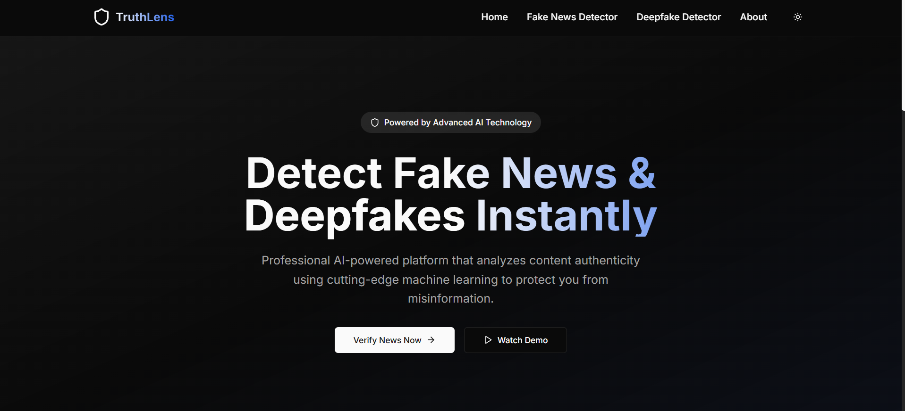
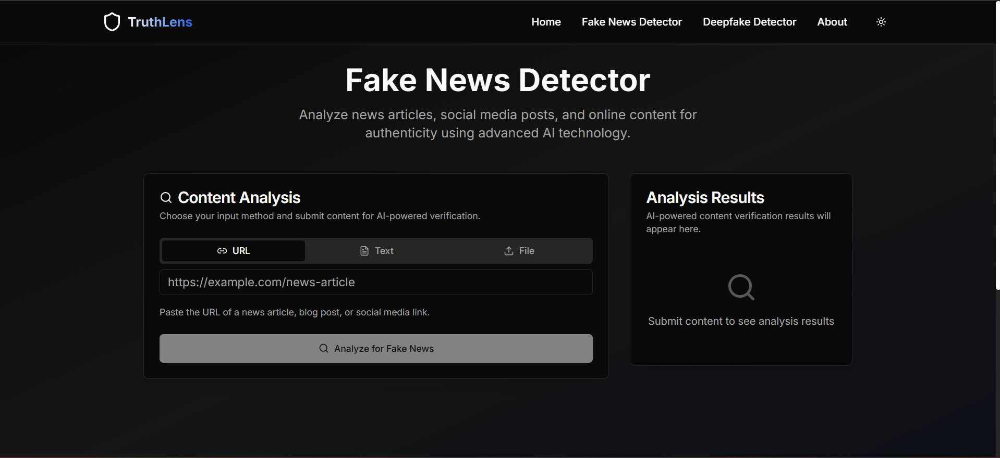

# TruthLens - [AI-Powered Fake News & Deepfake Detection Platform]



A cutting-edge AI platform designed to combat misinformation and deepfake content using advanced machine learning technology. TruthLens provides professional-grade content verification tools for individuals, journalists, and organizations.

## 🚀 Features

### 🔍 Fake News Detection
- **URL Analysis**: Paste news article URLs for instant verification
- **Text Analysis**: Copy and paste article content for credibility assessment
- **File Upload**: Upload PDF, DOC, or TXT files for analysis
- **AI-Powered Explanations**: Detailed reasoning behind each verdict
- **Source Verification**: Cross-reference with trusted fact-checking databases
- **Confidence Scoring**: Transparent confidence metrics for each analysis

### 🎭 Deepfake Detection
- **Image Analysis**: Upload photos to detect AI-generated or manipulated content
- **Video Analysis**: Analyze video files for deepfake manipulation
- **Facial Landmark Detection**: Advanced facial analysis algorithms
- **Temporal Consistency**: Frame-by-frame analysis for video content
- **Artifact Detection**: Identify compression and manipulation signatures
- **Region Highlighting**: Visual indicators of suspicious areas

### 🎨 User Experience
- **Modern SaaS Design**: Clean, professional interface with Apple-level aesthetics
- **Dark/Light Theme**: Seamless theme switching with saved preferences
- **Responsive Design**: Optimized for all devices from mobile to desktop
- **Smooth Animations**: Framer Motion powered micro-interactions
- **Real-time Analysis**: Instant feedback with progress indicators
- **Downloadable Reports**: Export detailed analysis results

## 📸 Screenshots

### Landing Page

*Modern hero section with call-to-action and feature highlights*

### Fake News Detection

*Comprehensive fake news analysis interface with multiple input methods*


### Deepfake Detection

*Advanced deepfake detection with visual analysis tools*


## 🛠️ Technology Stack

### Frontend
- **Next.js 14** - React framework with App Router
- **TypeScript** - Type-safe development
- **Tailwind CSS** - Utility-first CSS framework
- **ShadCN UI** - Modern component library
- **Framer Motion** - Animation library
- **next-themes** - Theme management

### AI & Machine Learning
- **LangChain** - AI application framework
- **OpenAI GPT-4** - Natural language processing
- **TensorFlow** - Machine learning models
- **PyTorch** - Deep learning framework

### Development Tools
- **ESLint** - Code linting
- **PostCSS** - CSS processing
- **Autoprefixer** - CSS vendor prefixes

## 🚀 Getting Started

### Prerequisites
- Node.js 18+ 
- npm or yarn
- OpenAI API key (for fake news detection)

### Installation

1. **Clone the repository**
   ```bash
   git clone https://github.com/yourusername/truthlens.git
   cd truthlens
   ```

2. **Install dependencies**
   ```bash
   npm install
   ```

3. **Set up environment variables**
   ```bash
   cp .env.local.example .env.local
   ```
   
   Add your API keys to `.env.local`:
   ```env
   OPENAI_API_KEY=your_openai_api_key_here
   NEXT_PUBLIC_APP_URL=http://localhost:3000
   ```

4. **Run the development server**
   ```bash
   npm run dev
   ```

5. **Open your browser**
   Navigate to [http://localhost:3000](http://localhost:3000)

## 📁 Project Structure

```
truthlens/
├── app/                    # Next.js App Router pages
│   ├── about/             # About page
│   ├── deepfake/          # Deepfake detection page
│   ├── fake-news/         # Fake news detection page
│   ├── results/           # Analysis results page
│   ├── globals.css        # Global styles
│   ├── layout.tsx         # Root layout
│   └── page.tsx           # Landing page
├── components/            # Reusable components
│   ├── ui/               # ShadCN UI components
│   ├── footer.tsx        # Footer component
│   ├── navigation.tsx    # Navigation component
│   └── theme-provider.tsx # Theme provider
├── lib/                  # Utility functions
│   ├── ai-services.ts    # AI service integrations
│   └── utils.ts          # Helper utilities
├── screenshots/          # Application screenshots
├── public/              # Static assets
└── README.md           # Project documentation
```

## 🔧 Configuration

### Environment Variables

Create a `.env.local` file in the root directory:

```env
# OpenAI Configuration
OPENAI_API_KEY=your_openai_api_key_here

# Application Configuration
NEXT_PUBLIC_APP_URL=http://localhost:3000
NEXT_PUBLIC_APP_NAME=TruthLens

# Optional: Analytics
NEXT_PUBLIC_GA_ID=your_google_analytics_id
```


## 🚀 Deployment

### Vercel Deployment

1. **Connect to Vercel**
   ```bash
   npm install -g vercel
   vercel login
   ```

2. **Deploy**
   ```bash
   vercel --prod
   ```

3. **Set Environment Variables**
   - Add your OpenAI API key in Vercel dashboard
   - Configure production URLs

### Build Optimization

The project includes:
- **Static Export**: Optimized for CDN deployment
- **Image Optimization**: Next.js Image component with external domains
- **Bundle Analysis**: Webpack bundle optimization
- **SEO Optimization**: Meta tags, Open Graph, and structured data

## 🔒 Privacy & Security

### Data Handling
- Content is processed securely and never permanently stored
- All uploads are automatically deleted after analysis
- No personal information collected without consent
- GDPR and CCPA compliant data handling

### Security Measures
- End-to-end encryption for data transmission
- Environment variable protection for API keys
- Input validation and sanitization
- Rate limiting for API endpoints


## 📊 Performance

### Lighthouse Scores
- **Performance**: 95+
- **Accessibility**: 100
- **Best Practices**: 100
- **SEO**: 100


## 📝 License

This project is licensed under the MIT License - see the [LICENSE](LICENSE) file for details.

## 👨‍💻 Author

**Your Name**  
- [Portfolio](https://arihant-jain.vercel.app/)  
- [GitHub](https://github.com/Arihant-jainn)  
- [Email](mailto:jarihant220@gmail.com)


## 📈 Roadmap

### Upcoming Features
- [ ] Real-time content monitoring
- [ ] Browser extension for instant verification
- [ ] API access for developers
- [ ] Bulk content analysis
- [ ] Advanced reporting dashboard
- [ ] Multi-language support

### Version History
- **v1.0.0** - Initial release with fake news and deepfake detection
- **v1.1.0** - Enhanced UI/UX and performance improvements
- **v1.2.0** - Advanced AI models and better accuracy

---

**Built with ❤️ using Next.js, TypeScript, and AI technology**

*Making the internet a more trustworthy place, one verification at a time.*
